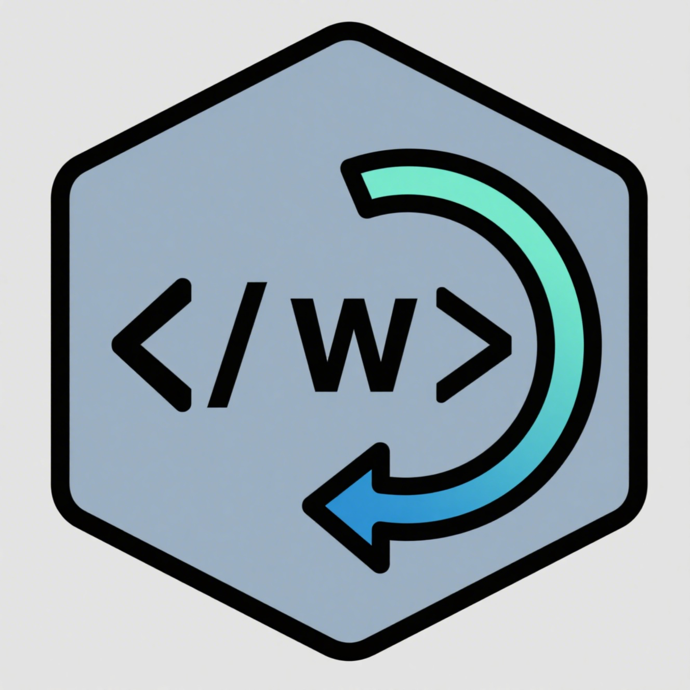

<div align="center">
  
</div>

# EnhancedWDL

Professional syntax highlighting and language support extension for WDL (Workflow Description Language) files with enhanced features for modern code editors.

**[中文文档](README.md) | English**

## ✨ Key Features

### 🎨 Syntax Highlighting
- Complete highlighting for WDL keywords, data types, operators, and syntax structures
- Support for string interpolation syntax: `~{variable}` and `${expression}`
- `#` style comment highlighting
- Command block highlighting with embedded shell script support
- Smart bracket matching and auto-closing
- Automatic association with `.wdl` files

### 🧠 Intelligent Language Services
- **Task Input Hints**: Display required input parameters when calling tasks
- **Output Auto-completion**: Provide intelligent completion when referencing task outputs
- **Hover Information**: Show detailed parameter information on mouse hover
- **Real-time Validation**: Real-time syntax error checking and highlighting
- **Symbol Resolution**: Support for both local task definitions and imported tasks
- **Import Alias Handling**: Properly handle import aliases

## 🔧 Supported WDL Elements

### Basic Syntax
- Version declarations (`version 2.0`)
- Import statements with aliases (`import "file.wdl" as alias`)
- Workflow and task definitions
- Struct definitions (WDL 2.0)
- Input/output blocks
- Command blocks (`<<<` and `>>>` delimiters)
- Runtime specifications

### Data Types
- Primitive types: `String`, `Int`, `Float`, `Boolean`, `File`
- Collection types: `Array`, `Map`, `Pair`, `Object`
- Generic nesting: `Array[Map[String, File]]`
- Custom struct types

### Control Flow
- Conditional statements: `if/else`
- Scatter blocks: `scatter`
- Variable references and string interpolation

### Built-in Functions
`select_first`, `select_all`, `defined`, `length`, `basename`, `size`, `glob`, `read_*`, `write_*`, `stdout`, `stderr`, `floor`, `ceil`, `round`, `min`, `max`, `sep`, `quote`, `squote`, `sub`, `range`, `transpose`, `zip`, `cross`, `unzip`, `flatten`

## 🚀 Usage

### Task Input Hints
Get auto-completion suggestions for input parameters when writing task calls:

```wdl
call ProcessSample {
    input:
        sample_name = "test",  // Auto-completion will suggest available input parameters
        input_file = some_file,
        // Type here to see more input suggestions
}
```

### Task Output References
Get intelligent completion when referencing task outputs:

```wdl
call ProcessSample { ... }

call QualityCheck {
    input:
        input_file = ProcessSample.  // Auto-completion shows available outputs
}
```

### Hover Information
Hover over the following elements:
- Task names: View input/output signatures
- Parameter names: View type and description
- Task.output references: View output details

## 📦 Installation

### Easy Installation
1. Go to the [Releases](https://github.com/pzweuj/EnhancedWDL/releases) page and download the latest `.vsix` file
2. Drag and drop the `.vsix` file into the VS Code editor's extensions panel
3. Open `.wdl` files to use all features

### Supported Editors
- VS Code
- VS Code-based editors: Cursor, Trae, Kiro, etc.

## 🏗️ Technical Architecture

Based on Language Server Protocol (LSP) architecture:

1. **Lexer**: WDL syntax tokenization
2. **Parser**: Generate Abstract Syntax Tree (AST)
3. **Symbol Provider**: Manage task and workflow symbols
4. **Completion Provider**: Provide auto-completion suggestions
5. **Hover Provider**: Provide hover information
6. **Diagnostic Provider**: Validate WDL syntax
